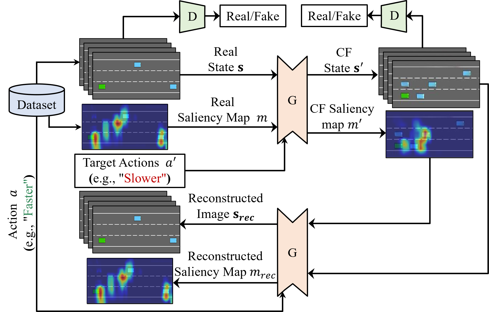

# SAFE-RL: Saliency-Aware Counterfactual Explainer for Deep Reinforcement Learning Policies

## SAFE-RL Framework

The proposed generator provides Counterfactual (CF) explanations for a given Deep Reinforcement Learning (DRL) model. By leveraging the saliency map of the DRL model, the generator is able to apply modifications to the salient pixels, resulting in sparse, valid, and plausible CFs. This repository also provides state-of-the-art methods, including [Olson et al.](https://arxiv.org/abs/2101.12446 'Olson paper') and [Huber et al.](https://arxiv.org/abs/2302.12689 'Huber paper') models.


## Installation

First, install the requirements:
For conda users:
```bash
conda create --name SAFE_RL python=3.8
conda activate SAFE_RL
```
for all users:
```bash
pip install -r requirements.txt
```

To properly install baselines, you have to use their Git repository, not pip.

```bash
git clone https://github.com/openai/baselines.git
cd baselines
pip install -e .
```
Now you can explore the dataset generation, training, and evaluation procedures through the "Main Code" description in the Jupyter notebook:

```bash
jupyter jupyter notebook SAFE_RL.ipynb
```

To reproduce the results reported in the paper, please follow these procedures:
- train the greybox DRL agents (the agents will be saved in the direcory `/teacher_models`) 
- generate datasets (the datasets of RGB and grey observations, associated with the actions, will be saved in the directory `/dataset/"Environment"/"DRL model"`)
- Train the SAFE-RL model (the generator and discriminator models, along with training images, will be saved in the directory `/baseline/"CF method"/"Environment"/"DRL agent"`)
- Evaluate the trained SAFE-RL model (a CSV file and images will be saved in the directory `/baseline/"CF method"/"Environment"/"DRL agent"`)
